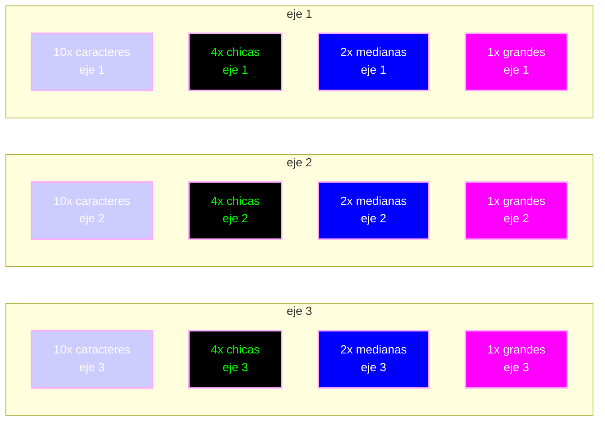
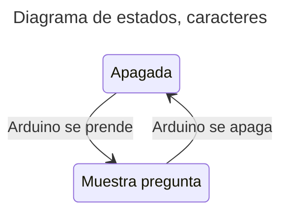
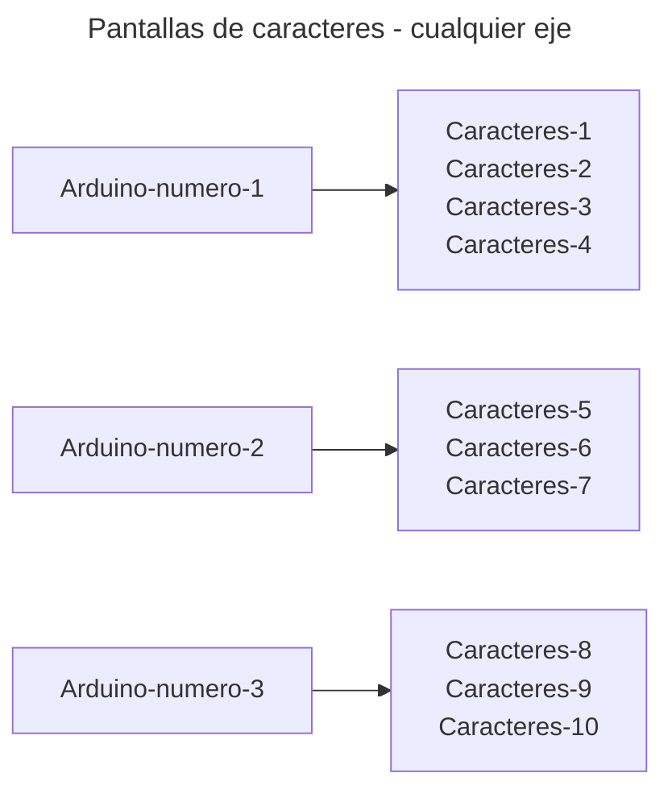
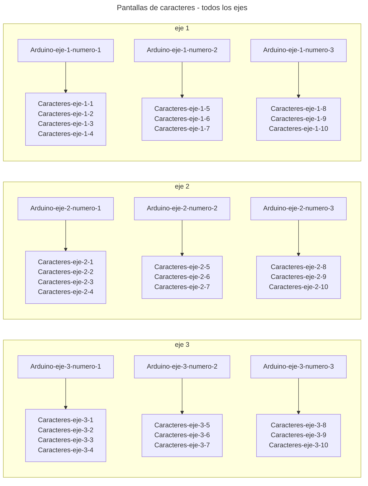
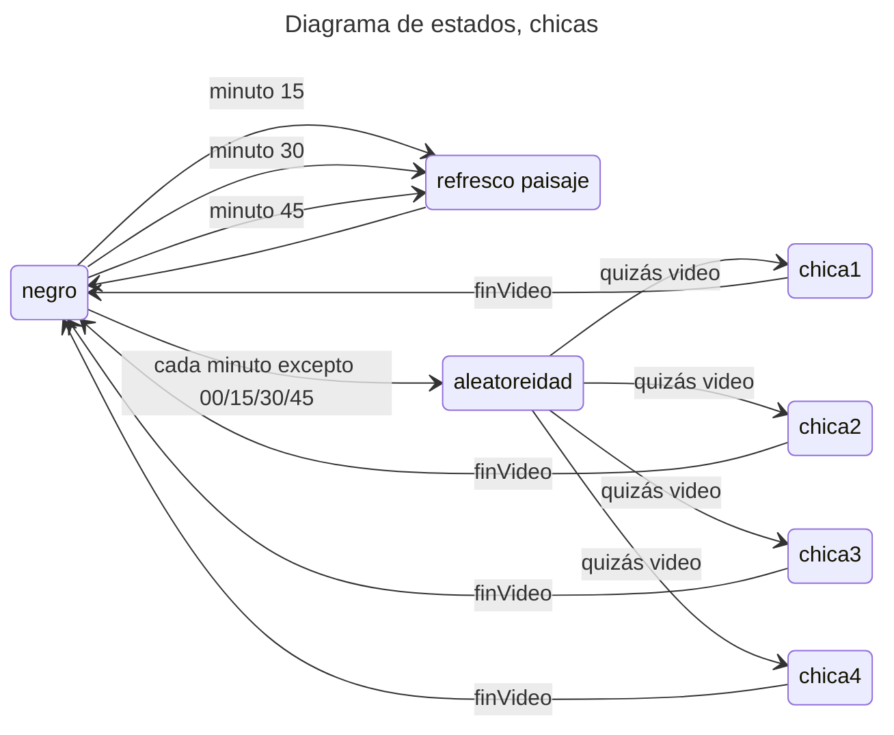

# 2025-expo-diseno-udp-montecarmelo

## Índice

- [Contenidos en general](#contenidos-en-general)
- [Bases de datos]
- [pantallas de caracteres](#pantallas-de-caracteres)

## Contenidos en general

Hay 3 ejes, numerados de 1 a 3.

Cada eje tiene una lógica y hardware equivalente.



### Preguntas en pantalla de caracteres

Eje 1:

1. El diseño especulativo ensaya futuros que cuestionan lo existente
2. ¿De qué sirve la interdisciplina en el diseño y por qué es valioso incorporarla?
3. ¿Qué entendemos por creación en diseño?
4. En diseño, los resultados pueden ser sistemas más que productos finales
5. Los procesos que generamos son el resultado más allá de un producto determinado
6. Los procesos generan sentido más allá del objeto final
7. Integrar lo tecnológico y lo ecológico exige pensar más allá de lo humano
8. La cultura hacker nos plantea que la tecnología es un lugar en constante disputa
9. No solo consumimos tecnología, sino que la tecnología transforma nuestras vidas
10. ¿Qué particularidades tienen las prácticas que se gestan en América Latina?

Eje 2:

1. Toda forma es memoria de decisiones técnicas y culturales pasadas
2. El reciclaje estético del pasado debilita toda función utópica
3. Una cultura que recicla el pasado anula el potencial utópico del diseño
4. ¿Cómo podemos hacernos cargo de aquello que aparece como marginalidad del diseño?
5. ¿Cómo podemos establecer límites en el diseño? ¿Dónde empieza y dónde termina?
6. Diseñar con otros implica reconocer su saber y capacidad creativa
7. No se trata solo de diseñar objetos o servicios, sino de diseñar mundos
8. El diseño se vuelve medio para afirmar identidades y formas de vida
9. El diseño es clave para crear futuros justos, sostenibles y comunes
10. ¿Cómo activar desde el diseño una imaginación política transformadora?

Eje 3

1. ¿Qué tipo de educación en arte, arquitectura y diseño se necesita en Chile?
2. El diseño no es solo disciplina, es una actividad esencial de la vida humana
3. Diseñar es transformar el mundo y, con ello, las formas de humanidad
4. Al diseñar objetos, transformamos el mundo y lo que significa ser humano
5. Si bien el diseño se presenta como al servicio del humano, tiene como ambición rediseñarlo
6. ¿Cómo el diseño moldea nuestras conductas, deseos y formas de habitar?
7. Necesitamos tecnologías situadas, fuera de la hegemonía del norte global
8. Diseñar tecnologías desde el sur global es clave para pensar otros futuros
9. ¿Cómo podríamos, desde el diseño, proponer nuevas maneras de entender la tecnología?
10. La tecnología no es neutra, es política

## Pantallas de caracteres



Cada eje tiene 3 Arduino, numerados del 1 a 3, que se encargan de las siguientes frases:

Arduino-numero-1: 4 frases
Arduino-numero-2: 3 frases
Arduino-numero-3: 3 frases

Entonces los 9 Arduino usados son:

1. Arduino-eje-1-numero-1
2. Arduino-eje-1-numero-2
3. Arduino-eje-1-numero-3
4. Arduino-eje-2-numero-1
5. Arduino-eje-2-numero-2
6. Arduino-eje-2-numero-3
7. Arduino-eje-3-numero-1
8. Arduino-eje-3-numero-2
9. Arduino-eje-3-numero-3





### Hardware para pantallas de caracteres

Las pantallas de caracteres son Pantalla LCD Verde 20x04 2004 con i2c <https://afel.cl/products/pantalla-lcd-verde-20x04-2004-con-i2c>

Si tomamos los jumpers de izquierda a derecha, dicen A0, A1, A2, y podemos decir que sin intevenir parten en 000, y al soldar cualquiera, resulta en 1, con lo que las posibilidades son:

| Jumpers | A0 | A1 | A2 | Dirección |
| ------- | -- | -- | -- | --------- |
| 000     | 0  | 0  | 0  | 0x27      |
| 001     | 0  | 0  | 1  | 0x23      |
| 010     | 0  | 1  | 0  | 0x25      |
| 011     | 0  | 1  | 1  | 0x21      |
| 100     | 1  | 0  | 0  | 0x26      |
| 101     | 1  | 0  | 1  | 0x22      |
| 110     | 1  | 1  | 0  | 0x24      |
| 111     | 1  | 1  | 1  | 0x20      |

Cada pantalla de caracteres tiene un potenciómetro con el que se regula la intensidad de la luz.

Cada pantalla de caracteres se conecta a alimentación en Arduino: GND y 5V.

Cada pantalla de caracteres se conecta a 2 pines en Arduino, la patita de datos SDA se conecta a A4, y la patita de clock SCL se conecta a A5. Se sugiere

- Cable rojo a 5V
- Cable verde a GND
- Cable blanco a A4 SDA
- Cable azul a A5 SCL

### Software de pantallas de caracteres

## Pantallas chicas con Raspberry Pi

borrador



## Base de datos

Organizadas en 4 pendrives

### Carpeta ejes

- `eje-1.mp4`
- `eje-2.mp4`
- `eje-3.mp4`

## Carpeta generativas

subcarpetas:

- horizontal-1-arica
- horizontal-2-antofagasta
- horizontal-3-valpo
- horizontal-4-aysen
- horizontal-5-magallanes
- vertical-1-arica
- vertical-2-antofagasta
- vertical-4-aysen
- vertical-5-magallanes

en cada subcarpeta hay 20 videos, desde 0.mov a 19.mov

### Videos de preguntas

### Videos de respuestas

- `001.mp4` a `098.mp4`, faltan algunos

```bash
# preguntas
curl -L "https://www.dropbox.com/scl/fo/f2ambvsbxbwtf6wc4tobq/AN-NjzJnQLvHv-fL3llbsKo?rlkey=v7toss3tq3gtsc7ysbawpgrgd&dl=1" > preguntas.zip
```

```bash
# 
curl -L "https://dropbox.com/scl/fo/tfw5kolr5j1315hu786pc/AD96AmiWAiCZbJgoPz6h96c?rlkey=hsp57zw9aitt7uvlbi9l3hhbm&st=bud75oq0&dl=1" > dia-01.zip
```

dia-02

```bash
curl -L "https://www.dropbox.com/scl/fo/6am51z9b7pujhfbmgz0z2/AA0VGTswSzKxF1UA67uPqzA?rlkey=5zbmkwfh5aswlanrs8oea7ikk&st=vglgg0hh&dl=1" > dia-02.zip
```

gracias

```bash
curl -L "https://www.dropbox.com/scl/fi/619ch4muonjt30a0bbpd3/gracias.zip? rlkey=adi5ginh75paizr9zsh9c9w6j&dl=1" > gracias.zip
```

```bash
curl -L "https://www.dropbox.com/scl/fo/3r1fue255qoz44qeycqkr/AHjgOFN2GZxVBgKXyr9SPpU?rlkey=kvpz4wgsz4n6bd4h4r3g8mo7j&st=uw3acjb8&dl=1" > respuestas.zip
```

## python script en boot

```bash
# crear servicio en el sistema
sudo nano /etc/systemd/system/expo.service
```

```bash
# pegar esto en la consola
[Unit]
Description=Script Expo Diseno Montecarmelo (Una Sola Vez)
After=graphical.target

[Service]
Environment=DISPLAY=:0
User=discusiones03

# Le dice a systemd que es un script que se ejecuta una vez y termina
Type=oneshot

WorkingDirectory=/home/discusiones03/2025-expo-diseno-udp-montecarmelo/mostrarPython

# Ejecuta el script y descarta los mensajes de error (para el warning de audio)
ExecStart=/bin/sh -c '/usr/bin/python3 /home/discusiones03/2025-expo-diseno-udp-montecarmelo/mostrarPython/script-v0.py 2>/dev/null'

[Install]
WantedBy=graphical.target
```

```bash
# guardar con ctrl + X

# Y para Yes

# recargar sistema
sudo systemctl daemon-reload

#reiniciar el servidor (ejecutará el script)
sudo systemctl restart expo.service

# revisar el estado
systemctl status expo.service
```

## Configuración computadoras

Hay Raspberry Pi 5, de 8GB y de 4 GB de de RAM.

Cada raspi está conectada a 1 o 2 pantallas.

Hay 3 grupos de raspis, 1 por cada eje, más una raspi principal.

## Configuración LAN

LAN: local area network

Las computadoras tienen toda la IP 192.168.1.x

donde x indica qué computadora es

Aquí está la lista con sus pantallas

| IP           | eje | tipo      | pantallas | orientación | contenidos |
| ------------ | --- | --------- | --------- | ----------- | ---------- |
| 192.168.1.11 | 1   | chica 1   | 2x 15in   | vertical    | respuestas |
| 192.168.1.12 | 1   | chica 2   | 2x 15in   | vertical    | respuestas |
| 192.168.1.13 | 1   | mediana 1 | 1x 32in   | horizontal  | preguntas  |
| 192.168.1.14 | 1   | mediana 2 | 1x 32in   | vertical    | ejes       |
| 192.168.1.15 | 1   | grande    | 1x 43in   | horizontal  | generativo |
| 192.168.1.21 | 2   | chica 1   | 2x 15in   | vertical    | respuestas |
| 192.168.1.22 | 2   | chica 2   | 2x 15in   | vertical    | respuestas |
| 192.168.1.23 | 2   | mediana 1 | 1x 32in   | horizontal  | preguntas  |
| 192.168.1.24 | 2   | mediana 2 | 1x 32in   | vertical    | ejes       |
| 192.168.1.25 | 2   | grande    | 1x 43in   | horizontal  | generativo |
| 192.168.1.31 | 3   | chica 1   | 2x 15in   | vertical    | respuestas |
| 192.168.1.32 | 3   | chica 2   | 2x 15in   | vertical    | respuestas |
| 192.168.1.33 | 3   | mediana 1 | 1x 32in   | horizontal  | preguntas  |
| 192.168.1.34 | 3   | mediana 2 | 1x 32in   | vertical    | ejes       |
| 192.168.1.35 | 3   | grande    | 1x 43in   | horizontal  | generativo |
| 192.168.1.40 | 3   | principal | nada      | nada        | clientes   |

aparte están las siguientes IP asignadas para computadores dev y de pruebas:

- `192.168.1.50`: macboook aaron
- `192.168.1.51`: ipad aaron
- `192.168.1.52`: macbook mateo
- `192.168.1.53`: macbook janis

## Testeo con OSC

en ipad tenemos la app TouchOSC con la siguiente app:

## Créditos

Contenidos por Escuela de Diseño UDP.

Códig por @montoyamoraga y @matbutom.

## Licencia

MIT
